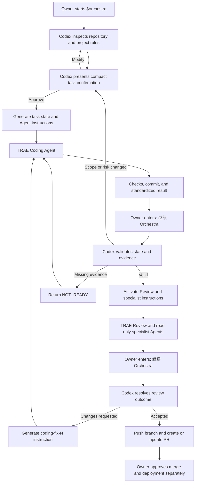

# Orchestra

Orchestra is an explicit, low-token development workflow for coordinating a project owner, GPT, Codex, and independent TRAE coding and review agents.

Orchestra 是一套显式调用、节省 Codex 额度的个人多 Agent 开发流程，用于协调项目所有者、GPT、Codex、TRAE Coding Agent 和独立的 TRAE Review Agent。

## Core workflow / 核心流程

| Role | Responsibility |
|---|---|
| Project owner | Product direction, scope, merge, and deployment decisions |
| GPT | Product outline, ideas, options, and Product Brief |
| Codex | Major technical planning and targeted milestone or exception review |
| TRAE Coding Agent | Implementation and required checks |
| TRAE Review Agent | Independent review against acceptance criteria |

Tasks are classified as:

- **Quick** — low-risk local changes; skip Codex and use a five-line report.
- **Standard** — reuse an approved plan; TRAE implements and independently reviews.
- **Major** — Codex prepares the technical plan and performs targeted acceptance when triggered.

The workflow also covers later upgrades, Git/GitHub permissions, sequential Agent handoffs in one worktree, rollback planning, and compact reporting.

Agent handoffs use commits as review boundaries: saving does not require a commit, but a Coding Agent must commit all task changes, leave a clean worktree, and report the base/head commits before handing work to a Review Agent or Codex. Review Agents do not edit or commit code.

## Planned 1.0.2 orchestration / 规划中的 1.0.2 自动编排

The approved 1.0.2 design makes Codex a persistent controller after explicit activation. The implementation is not released yet.



Full design: [`docs/superpowers/specs/2026-07-29-orchestra-1.0.2-automation-design.md`](docs/superpowers/specs/2026-07-29-orchestra-1.0.2-automation-design.md)

## Install / 安装

Clone the repository:

```bash
git clone https://github.com/Stramboo/orchestra.git
```

Copy `skills/orchestra` into your global Codex skills directory:

```bash
cp -R orchestra/skills/orchestra ~/.codex/skills/orchestra
```

Windows PowerShell:

```powershell
Copy-Item -Recurse .\orchestra\skills\orchestra "$HOME\.codex\skills\orchestra"
```

Restart Codex or open a new task so the Skill list reloads.

## Use / 使用

Orchestra does not trigger implicitly. Invoke it explicitly:

```text
Use $orchestra to enable my AI development workflow for this existing project.
```

```text
使用 $orchestra 为当前项目启用我的 AI 开发流程。
```

Other examples:

```text
使用 $orchestra 判断这个任务属于 Quick、Standard 还是 Major。
使用 $orchestra 为下一位 TRAE Coding Agent 创建交接材料。
使用 $orchestra 准备最小 Codex 验收上下文。
```

## Repository layout / 仓库结构

```text
skills/orchestra/
├── SKILL.md
├── agents/openai.yaml
├── references/
└── assets/
```

The reusable project rules and task templates are stored under `assets/`. Detailed routing and adoption guidance is loaded from `references/` only when needed.

## Safety / 安全边界

- The project owner retains merge and deployment authority.
- Force pushes, history rewrites, remote deletion, and destructive operations require explicit approval.
- Secrets, personal contact information, and payment data must not be included in prompts, reports, source files, or commits.
- Existing uncommitted work must be preserved and unrelated changes must not be staged.

## License

[MIT](LICENSE)
