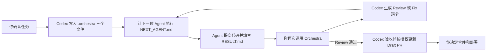

# Orchestra

Orchestra 是一个轻量 Codex Skill：用户确认任务后，Codex 在当前项目写入三个本地 Markdown 文件，让 TRAE Coding 和 Review Agent 顺序接力。

Orchestra 不直接运行 TRAE Agent，也不是状态机、任务平台或 Agent 安全系统。

## Workflow



项目内只使用：

```text
.orchestra/
├── TASK.md
├── NEXT_AGENT.md
└── RESULT.md
```

- `TASK.md`：当前任务的目标、范围、验收和可读步骤。
- `NEXT_AGENT.md`：下一位 Agent 可以直接执行的完整指令。
- `RESULT.md`：最近一位 Agent 的简短结果；下一阶段可以覆盖。

三个文件是本地交接便笺，不保存任务历史。Git 项目会把 `.orchestra/` 写入本地 `.git/info/exclude`，不会修改项目 `.gitignore`，也不会进入任务 commit。

## Install

```bash
git clone https://github.com/Stramboo/orchestra.git
cp -R orchestra/skills/orchestra ~/.codex/skills/orchestra
```

Windows PowerShell：

```powershell
Copy-Item -Recurse .\orchestra\skills\orchestra "$HOME\.codex\skills\orchestra"
```

重启 Codex 或打开新任务，让 Skill 列表重新加载。

## Use

### 1. 确认任务

```text
使用 $orchestra 开始这个任务。
```

任务明确后，Codex 自动写入 `.orchestra/`。聊天中只告诉你下一位 Agent 类型和 `NEXT_AGENT.md` 路径，不再粘贴长提示词。

### 2. 让 Agent 执行

让 TRAE Agent 读取并执行：

```text
.orchestra/NEXT_AGENT.md
```

Coding/Fix Agent 修改任务代码、运行检查、创建 commit，并填写 `RESULT.md`。Review Agent 独立只读审查，只能填写 `RESULT.md`。

### 3. 继续 Orchestra

Agent 完成后告诉 Codex：

```text
继续 Orchestra。
```

Codex 读取结果和最小 Git 证据，然后自动进入 Review、Fix、完成或 Draft PR 阶段。

如果项目目录不可写，Orchestra 才退回在聊天中输出完整 Agent 指令。

## Levels

- Quick：局部低风险任务，默认可以省略独立 Review。
- Standard：Coding → commit → independent Review。
- Major：Codex Technical Plan → owner approval → Coding → Review → Codex acceptance。

## Boundaries

- 同一 worktree 同时只有一个源码写入 Agent。
- Coding/Fix Agent 正式交接前提交任务代码；不要求每次保存都 commit。
- Review Agent 只审查明确的 `base...head`，不修改源码或创建 commit。
- 无关用户改动必须保留。
- Codex 可按已有授权 push 和创建或更新 Draft PR。
- merge、deploy、force-push、历史重写和远程删除由项目所有者决定。

## Repository

```text
skills/orchestra/
├── SKILL.md
├── agents/openai.yaml
├── assets/
│   ├── AI_DEVELOPMENT_WORKFLOW.md
│   ├── CODING_HANDOFF.md
│   └── REVIEW_HANDOFF.md
└── references/workflow.md
```

License: [MIT](LICENSE)
