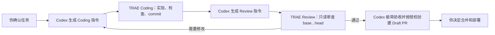

# Orchestra

Orchestra 是一个轻量 Codex Skill：确认任务后，自动生成下一位 TRAE Coding 或 Review Agent 的完整指令，并用 Git commit 完成交接。

它不是任务管理平台，不运行 Agent，也不建立状态机、数据库、结果 ingest 或防恶意 Agent 系统。

## Workflow



- Quick：默认省略独立 Review。
- Standard：Coding → commit → independent Review。
- Major：Codex Technical Plan → owner approval → Coding → Review → Codex acceptance。

## Install

```bash
git clone https://github.com/Stramboo/orchestra.git
cp -R orchestra/skills/orchestra ~/.codex/skills/orchestra
```

Windows PowerShell：

```powershell
Copy-Item -Recurse .\orchestra\skills\orchestra "$HOME\.codex\skills\orchestra"
```

重启 Codex 或打开新任务，让 Skill 列表重新加载。

## Use

```text
使用 $orchestra 开始这个任务，并自动生成下一位 TRAE Agent 的指令。
```

之后无需再次询问“下一步该给谁什么指令”：

- 任务明确后，Codex 自动给出 Coding 指令。
- Coding 提供 commit 后，Codex 自动给出 Review 指令。
- Review 要求修改时，Codex 自动给出修正指令。
- Review 通过后，Codex只给极简结论，并按已有授权 push/Draft PR。

## Core rules

- 同一 worktree 同时只有一个写入 Agent。
- Coding 正式交接前必须 commit；不要求每次保存都 commit。
- Review 独立、只读，只审查明确的 `base...head`。
- Codex 额度优先用于 Major、异常、冲突和里程碑。
- 合并和部署始终由项目所有者决定。

## Repository

```text
skills/orchestra/
├── SKILL.md
├── agents/openai.yaml
├── assets/
│   ├── AI_DEVELOPMENT_WORKFLOW.md
│   ├── CODING_HANDOFF.md
│   └── REVIEW_HANDOFF.md
└── references/workflow.md
```

License: [MIT](LICENSE)
