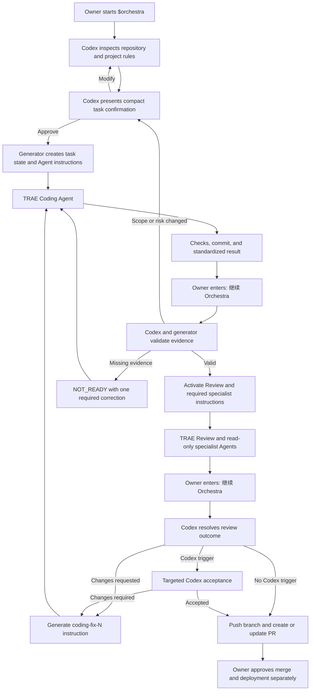
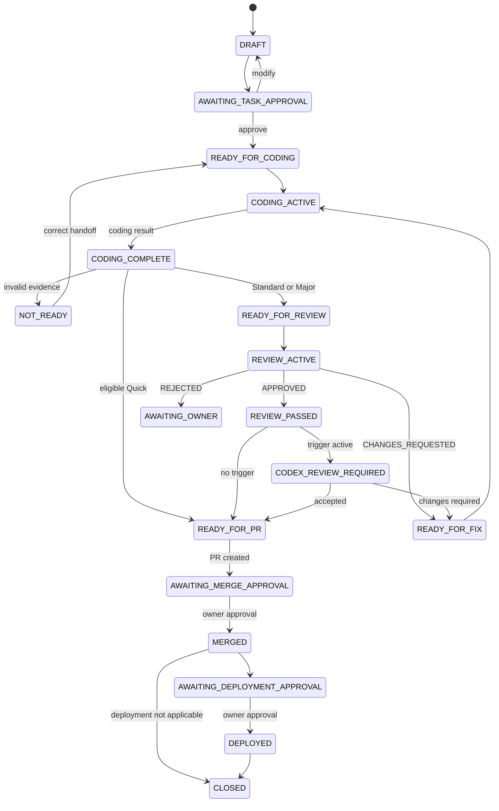

# Orchestra 1.0.2 Automated Orchestration Design

- Target version: 1.0.2
- Date: 2026-07-29
- Status: Written specification approved by the project owner
- Authority: Project owner
- Implementation status: Not started

## 1. Summary

Orchestra 1.0.2 turns Codex from an on-demand handoff writer into a persistent workflow controller for one active development task.

After the owner explicitly starts Orchestra, Codex inspects the repository, presents compact confirmation cards at configured gates, and uses a deterministic generator to create instructions for TRAE Coding, TRAE Review, and required specialist Agents. TRAE Agents write standardized results. The owner resumes the workflow with `继续 Orchestra`; Codex reads the current state, validates evidence, and advances to the next legal stage without requiring the owner to ask which Agent is needed or how to prompt it.

The release remains portable. It does not start TRAE, monitor files in the background, or depend on a TRAE API.

## 2. Problem

Orchestra 1.0.1 defines roles, risk levels, Git boundaries, templates, and Codex escalation rules, but each explicit invocation chooses only one primary mode. The owner must still ask Codex to classify the task, create a Coding handoff, create a Review handoff, and prepare later evidence packages separately.

This creates four problems:

1. The owner must remember the next role and request the next prompt.
2. Generated instructions can drift because no persistent state machine controls transitions.
3. Codex repeats context assembly instead of reading a compact task contract.
4. Missing commit, test, or review evidence can be discovered late.

## 3. Goals

Orchestra 1.0.2 must:

- remain active for one task after explicit activation;
- ask the owner only at configured confirmation gates;
- automatically create the complete Agent instruction package;
- use repository facts instead of chat as the task source of truth;
- resume from disk in a new Codex task;
- preserve the Quick, Standard, and Major risk model;
- retain the 1.0.1 commit handoff boundary;
- keep Codex review focused on milestones, risks, exceptions, and owner requests;
- prevent invalid state transitions and incomplete handoffs;
- keep generated prompts and reports compact;
- remain usable without a TRAE API, background service, or third-party Python package.

## 4. Non-goals

Version 1.0.2 will not:

- launch, control, or message TRAE directly;
- wake Codex automatically when files change;
- manage multiple active Orchestra tasks in one Codex conversation;
- approve merges, deployments, destructive actions, or permission expansion;
- make Codex perform full code review for every Standard task;
- store complete conversations, hidden reasoning, credentials, or large logs;
- refactor projects while adopting the workflow;
- overwrite an existing project `AGENTS.md` or Orchestra document.

## 5. Approved product decisions

The owner approved the following defaults:

| Decision | Approved choice |
|---|---|
| Automation boundary | Generate and write Agent instructions into the project |
| Confirmation policy | Configurable; default to key gates |
| Prompt timing | Shared task state with hybrid up-front and just-in-time generation |
| Storage | Durable plans, committable task packages, and ignored runtime state are separated |
| Agent routing | Deterministic risk rules with owner adjustment |
| Resume mechanism | The owner enters `继续 Orchestra` |
| Concurrency | One active Orchestra task per Codex conversation |
| Implementation approach | Codex controller plus a deterministic zero-dependency generator |

## 6. Architecture

### 6.1 Codex Orchestrator

Codex is the only component that:

- communicates with the project owner;
- interprets product and repository evidence;
- classifies task risk;
- selects the Agent roster;
- presents confirmation cards;
- decides whether a Codex review trigger is active;
- invokes the deterministic generator;
- pushes a validated task branch and creates or updates a PR when authorized.

Codex does not wait for the owner to request each handoff. After a valid owner response or `继续 Orchestra`, it calculates and prepares the next legal action.

### 6.2 Deterministic generator

The Skill adds `scripts/orchestra.py`, implemented with the Python standard library.

The generator:

- validates project and task schemas;
- creates and updates task state atomically;
- enforces legal transitions;
- routes known risk tags to Agent templates;
- renders Agent instructions;
- validates result files and Git evidence;
- reports one current state and one next action;
- cleans runtime artifacts at task close.

The generator does not call a model, interpret product intent, choose architecture, or approve a gate.

### 6.3 Project control plane

The project control plane contains durable documents, active task instructions, and ignored runtime state. It is the source of truth for resuming a task and must not depend on old chat content.

### 6.4 TRAE Agents

TRAE Agents read their role instruction and referenced project files. They write standardized result files instead of free-form reports.

- Coding Agents may modify source and create task commits.
- Review and specialist Agents are source-read-only.
- Review and specialist Agents write only their own ignored runtime result file.
- A Review Agent never fixes its own findings.

## 7. End-to-end flow



## 8. Project layout and ownership

```text
project/
├── docs/orchestra/
│   ├── PRODUCT_BRIEF.md
│   ├── TECHNICAL_PLAN.md
│   └── CODEX_ACCEPTANCE.md
│
└── .orchestra/
    ├── config.json
    ├── tasks/
    │   └── <task-id>/
    │       ├── task.json
    │       └── agents/
    │           ├── coding.md
    │           ├── review.md
    │           └── <specialist>.md
    │
    └── runtime/
        └── <task-id>/
            ├── state.json
            ├── results/
            │   ├── coding.json
            │   ├── review.json
            │   └── <specialist>.json
            └── logs/
```

### 8.1 Durable documents

`docs/orchestra/` stores approved Product Briefs, Technical Plans, rollback plans, and Codex acceptance records when the task level requires them.

### 8.2 Project configuration

`.orchestra/config.json` is tracked and stores:

- schema version;
- confirmation policy;
- project-specific task-level overrides;
- enabled specialist Agent types;
- task-history retention policy;
- verified command references;
- protected paths.

The generator must not overwrite an existing configuration. Adoption produces a proposed merge when a target exists.

### 8.3 Task package

`.orchestra/tasks/<task-id>/` contains the approved task contract and generated Agent instructions. Standard and Major task packages may be committed to the task branch so sequential Agents and worktrees can read them.

### 8.4 Runtime state

`.orchestra/runtime/` is always ignored by Git. It stores mutable state, Agent results, and minimal logs. Review results therefore do not dirty the source worktree.

### 8.5 Lifecycle

- Quick tasks use runtime files only and finish with the five-line report.
- Standard task instructions may exist on the task branch during execution.
- Major approved plans remain under `docs/orchestra/`.
- Before PR creation, `close` removes temporary instructions and produces a compact result.
- `close` may remove only generator-owned paths recorded in the task manifest whose content hash still matches; a user-modified or unknown file stops cleanup.
- `retain_task_history` defaults to `false`.

## 9. Activation and commands

The first invocation remains explicit:

```text
使用 $orchestra 开发这个任务
```

After task approval, the current Codex conversation treats Orchestra as active until pause, stop, or close.

Owner commands:

| Command | Meaning |
|---|---|
| `继续 Orchestra` | Read state and results, validate evidence, and prepare the next legal action |
| `状态` | Show current stage, active Agent, blockers, evidence, and next action |
| `批准` | Approve only the currently displayed confirmation card |
| `修改：...` | Return to the relevant planning state and regenerate affected instructions |
| `暂停 Orchestra` | Preserve state without advancing |
| `停止 Orchestra` | Stop the workflow without deleting code or commits |
| `关闭 Orchestra` | Finalize and clean task runtime artifacts |

`继续 Orchestra` is never treated as approval.

To resume from another Codex conversation:

```text
使用 $orchestra 恢复 TASK-20260729-001
```

Codex reads the project control plane and does not require the old conversation.

## 10. Confirmation policy

The default policy is `key_gates`.

Confirmation is required for:

- initial task scope, level, and Agent roster;
- a Major Technical Plan;
- a scope, risk-level, or Agent-roster change;
- destructive actions or permission expansion;
- PR merge;
- deployment.

Evidence-complete transitions such as Coding to Review may advance without another approval.

Projects may configure `every_stage`, but 1.0.2 does not default to it because it reduces automation and increases interaction cost.

The confirmation card is limited to approximately eight lines:

```text
ORCHESTRA CHECKPOINT
Task: TASK-20260729-001
Stage: AWAITING_TASK_APPROVAL
Decision: Approve scope, level, and Agent roster
Goal: ...
Agents: Coding, Review, Security
Risk: Standard / security-sensitive
Reply: 批准 | 修改：... | 停止
```

## 11. State machine



Rules:

- one Codex conversation owns one active Orchestra task;
- parallel work requires another Codex conversation and worktree;
- only one Agent writes source in a worktree at a time;
- review and specialist Agents may read in parallel and write separate runtime results;
- the same substantive failure twice moves the task to `AWAITING_OWNER`;
- pause, stop, and close preserve source and Git history.

## 12. Generator interface

Codex invokes:

```text
bootstrap
create-task
render
status
ingest
advance
revise
close
validate
```

| Command | Responsibility |
|---|---|
| `bootstrap` | Create missing project control-plane files without overwriting existing rules |
| `create-task` | Validate a Codex-prepared task contract and initialize runtime state |
| `render` | Generate instructions for the approved Agent roster |
| `status` | Return one current state, blockers, evidence gaps, and next action |
| `ingest` | Validate one Agent result against its schema and current task |
| `advance` | Apply one legal event-driven transition |
| `revise` | Update confirmed task facts and regenerate only affected instructions |
| `close` | Remove temporary instructions and produce the configured compact completion record |
| `validate` | Check schemas, paths, state consistency, and Git handoff evidence |

Commands must be idempotent where no new event exists.

## 13. Task contract

`task.json` contains only execution facts:

```json
{
  "schema_version": "1.0.2",
  "task_id": "TASK-20260729-001",
  "revision": 1,
  "title": "Example bounded task",
  "level": "STANDARD",
  "goal": "One verifiable outcome",
  "approved_basis": {
    "product": "docs/orchestra/PRODUCT_BRIEF.md",
    "technical_plan": "docs/orchestra/TECHNICAL_PLAN.md"
  },
  "allowed_changes": [],
  "forbidden_changes": [],
  "relevant_files": [],
  "acceptance_criteria": [],
  "required_checks": [],
  "risk_tags": [],
  "agents": ["coding", "review"],
  "agent_overrides": {
    "add": [],
    "remove": [],
    "reason": ""
  },
  "confirmation_policy": "key_gates",
  "git": {
    "base_branch": "main",
    "task_branch": "codex/example-task",
    "worktree": "verified absolute path",
    "code_base_commit": "verified commit"
  }
}
```

The contract must not contain complete chat transcripts, hidden reasoning, credentials, environment-variable values, or embedded source files. Removing a role required by the default risk route requires a non-empty `agent_overrides.reason` and an owner confirmation record.

Paths in `approved_basis`, `allowed_changes`, `forbidden_changes`, and `relevant_files` use repository-relative POSIX form. A path ending in `/**` represents a subtree; no other wildcard syntax is supported. Absolute paths are allowed only for the separately verified worktree field.

## 14. Agent result contracts

### 14.1 Coding result

Required fields:

```text
status
files_changed
checks_and_results
base_commit
head_commit
deviation
residual_risk
blocker
```

The result is `NOT_READY` when:

- a required field is missing;
- task changes are uncommitted;
- the worktree is dirty;
- base or head does not match Git;
- required checks are absent without an approved exception;
- changed files exceed the approved scope.

### 14.2 Review result

Required fields:

```text
status: APPROVED | CHANGES_REQUESTED | REJECTED
reviewed_base
reviewed_head
blocking_findings
checks_reproduced
residual_risk
```

`CHANGES_REQUESTED` creates `coding-fix-<n>.md` for the original Coding Agent. The next review must use the new head commit.

### 14.3 Specialist result

Specialist Agents use the Review result structure plus:

```text
specialty
questions_answered
evidence_paths
```

Specialist results advise the primary Review and cannot approve merge or deployment.

## 15. Agent instruction contract

Every generated instruction contains only:

```text
Role
Goal
Read First
Allowed / Forbidden
Relevant Files
Steps
Acceptance
Required Checks
Result File
Stop Conditions
```

Instructions reference `task.json`, project `AGENTS.md`, and verified files instead of repeating repository context. Relevant-file lists default to no more than 12 entries. A Major task may exceed the limit only with a recorded reason.

## 16. Agent routing

Base routing:

| Task level | Required roles |
|---|---|
| Quick | Coding and required checks |
| Standard | Coding plus independent Review |
| Major | Coding, independent Review, and triggered Codex acceptance |

Specialist routing:

| Risk condition | Added Agent |
|---|---|
| Behavior changes without adequate test coverage | Testing |
| Authentication, authorization, privacy, secrets, or untrusted input | Security |
| Data, schema, storage, or file-structure migration | Migration |
| UI, responsive behavior, accessibility, or visual acceptance | UI |
| Dependency addition or upgrade | Dependency |
| CI, deployment, runtime configuration, or infrastructure | Deployment |
| A bounded risk outside the registry | Bounded Specialist |

Codex records the routing reasons in the confirmation card. The owner may add or remove an Agent; Codex recalculates risk and records the override.

## 17. Git and task-package lifecycle

- Standard and Major work use a task branch or worktree.
- A committed planning boundary may include `task.json` and Agent instructions.
- The implementation `code_base_commit` is recorded after the planning boundary.
- Coding Agents commit all task source changes before handoff.
- Review Agents inspect `base...head` and never commit source or result files.
- Runtime results remain ignored, so the worktree stays clean.
- Codex validates the final commit range before push.
- Codex may push task branches and create or update PRs.
- Merge and deployment require owner approval.
- Force push, history rewrite, remote deletion, and destructive operations require separate authorization.

## 18. Failure and security behavior

The generator must:

- write mutable state through a temporary file followed by atomic replacement;
- resolve and contain every generated path inside the verified project root;
- reject unknown schema versions and illegal transitions;
- preserve the previous state when validation fails;
- report one concrete correction instead of dumping a long trace;
- stop after two substantively equivalent failures;
- reject secrets and sensitive values from task packages and results;
- never run reset, clean, force push, remote deletion, data deletion, or deployment.

Codex must return to owner confirmation when repository evidence changes the approved scope, task level, Agent roster, permissions, or recovery risk.

## 19. Upgrade compatibility

When adopting 1.0.2 in a 1.0.1 project:

1. preserve the existing `AGENTS.md`, workflow policy, and `docs/orchestra/`;
2. inspect before creating `.orchestra/config.json`;
3. add only missing control-plane files;
4. propose a merge instead of overwriting an existing target;
5. preserve Quick five-line reports;
6. keep `allow_implicit_invocation: false`;
7. require explicit activation in a new Codex conversation;
8. run a bounded Standard task as the first forward test.

## 20. Validation strategy

### 20.1 Unit tests

Tests must cover:

- every legal state transition;
- representative illegal transitions;
- missing and malformed result fields;
- Quick, Standard, and Major base routing;
- every specialist routing trigger;
- owner Agent-roster overrides;
- atomic state writes;
- project-root path containment;
- Git branch, worktree, base, head, and dirty-state validation;
- idempotent render and status operations;
- 1.0.1 project adoption without overwrite.

### 20.2 Golden prompt tests

Golden files must cover:

- Quick Coding;
- Standard Coding and Review;
- Major Coding, Review, and Codex acceptance;
- Security plus Migration;
- UI plus Testing;
- one bounded generic specialist;
- one `coding-fix-1` loop.

### 20.3 Forward scenarios

Before release:

1. run a Standard task from confirmation through Review;
2. verify missing commit evidence produces `NOT_READY`;
3. verify `CHANGES_REQUESTED` creates the correction prompt;
4. verify a Security and Migration Major task adds both specialists;
5. resume an active task from a fresh Codex conversation;
6. verify Quick creates no persistent task document and no Codex code review.

## 21. Documentation and release

The implementation must:

- update `SKILL.md` with activation, resume, and orchestration behavior;
- add the deterministic generator and its templates or schemas;
- update workflow and adoption references to version 1.0.2;
- update project-rule assets and task templates;
- add repository tests outside the installed Skill directory;
- replace the README's planned-flow label with released behavior after verification;
- keep installation instructions current;
- open a Draft PR from a `codex/` branch;
- require owner approval before merge;
- create tag `v1.0.2` only after the merge is verified;
- sync the merged Skill to the global installation and validate byte identity.

## 22. Acceptance criteria

The 1.0.2 upgrade is complete only when:

- explicit activation creates one active task state;
- the owner can advance with `继续 Orchestra` without requesting a role or prompt;
- the generator produces correct Coding, Review, and triggered specialist instructions;
- invalid evidence cannot advance the task;
- a fresh Codex conversation can resume from the task ID;
- Quick work remains compact;
- Standard and Major handoffs preserve the 1.0.1 commit boundary;
- no background service or TRAE integration is required;
- tests and forward scenarios pass;
- README and design documentation render correctly on GitHub;
- the owner approves the PR merge;
- tag `v1.0.2`, repository `main`, and the installed global Skill contain the same released files.

## 23. Resolved questions

All product-design questions required for an implementation plan are resolved. Implementation remains gated by owner approval of the implementation plan.
